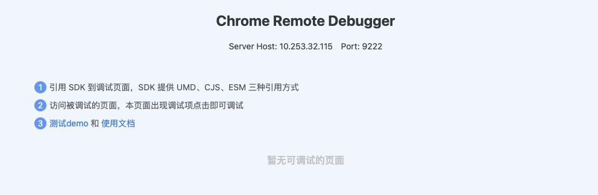

# Chrome Remote Debugger

To debugging web page by Chrome DevTools Protocol.

## Build

```sh
yarn run build:fe   # 构建静态资源代码
yarn run build:prod # 构建前后端代码
# OR
npm run build:fe   # 构建静态资源代码
npm run build:prod # 构建前后端代码
```

## Install

install 将 node_modules，public 文件夹软连接到 dist 目录

```sh
yarn install install
# OR
npm install install
```

## Usage

### Start

```sh
node start
```

The tool will start on port `3000` by default.

### Open Panel

The board UI start autoing at browser when you use start command.



### Import to client to your page

Debugging page must import our client to your page. The client supports three import mode.

- **ESM**:

```html
<script type="text/javascript" src="domain.com/js/agent.esm.js"></script>
```

Then you can new a instance to use it:

```js
new Agent().register()
```
