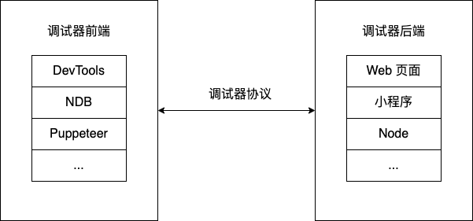
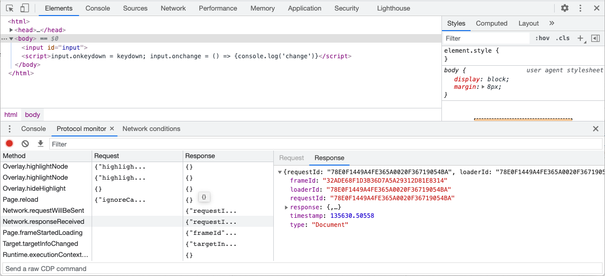
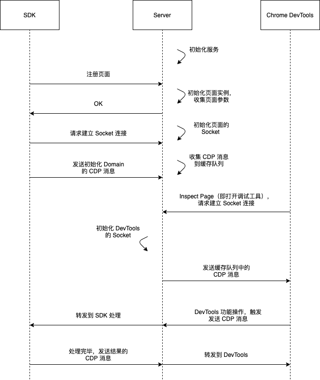

# Chrome DevTools 调试协议及实战

`Chrome DevTools` 是前端开发者经常用到的工具之一，无论是普通页面、移动端 `Webview`、小程序、甚至 Node 应用，都可以用它来调试。

`Chrome DevTools` 提供了丰富的调试功能，包括 `DOM`、网络、`debugger` 调试、性能分析等。

那么，我们思考 `Chrome DevTools` 是如何能够具有多端调试能力的呢，它是基于什么原理开发的呢，下面我们一起去探索。

## 架构原理

`Chrome DevTools` 的架构，相当于前后端分离的架构，用一张图来描述就是：



具体可以划分为调试器的前端和调试器的后端：

1. 调试器前端：调试器的可视化界面，对于 `Chrome` 来说，就是 `DevTools`；另外也有许多库 Puppeteer、`NDB` 等
2. 调试器后端：实现了调试协议的宿主环境，如 `Chrome` 的环境、`Node` 环境等
3. 调试协议：前后端消息的协议，通过 `socket` 双工通信建立协议的连接

## 探索

`Chrome DevTools` 实现了调试协议，以下称调试协议为 `CDP`（Chrome DevTools Protocol），`CDP` 的[官方文档](https://chromedevtools.github.io/devtools-protocol/) 提供了如何查看
`CDP` 调用链路的方法：

1. 首先，用命令行的方式启用 `Chrome`， 附带参数连接 `debug` 端口 9222：

```sh
    chrome --remote-debugging-port=9222
```
2. `Chrome` 启动后，打开调试工具在设置中开启 `Protocol monitor`，也就是 `CDP` 监控工具，之后可以看到 `CDP` 的调用情况：



图中清晰的展示了 `CDP` 的请求和响应，下面介绍下 `CDP`：

`CDP` 基于 [JSON-RPC](https://www.jsonrpc.org) 协议，包含由 `request` 请求参数和  `response` 响应参数。

`request` 请求参数由以下几部分构成：

* method: 包含要调用的方法名称的字符串
* params: 作为参数传递给方法的对象
* id: 请求id，它用于将响应与其所响应的请求相匹配，必须是唯一的

`response` 响应参数由以下几部分构成：

* result: 被调用方法返回的对象；如果调用该方法时出错，则该值必须为 `null`
* error: 如果调用该方法时出错，则返回 `Error` 对象。如果没有错误，则必须为空。
* id: `id` 必须与其响应的请求 `id` 相同

`Chrome DevTools` 通过和服务建立 Socket 连接的方式，调用 `CDP`，例如：

```js
    socket.send(JSON.stringif({ id: 1, method: 'DOM.highlightNode' })
```

## 业务痛点与思考

`Chrome DevTools` 在调试 PC 页面的时候很方便，调试端内 Webview 的时候无能为力； VConsole 在移动端页面的能力相对于 DevTools 太弱。

我们思考，既然无法直接调试 Webview，我们是否可以利用获取到 Webview 的一些关键信息，通过中间服务转发到 `Chrome DevTools`，同时 `Chrome DevTools` 的一些动作也可以通过中间服务转发到 Webview。于是，决定尝试一下。

## 实战

### 整体模型

我们设想了大致的一个模型，`SDK-Server-Chrome DevTools` 的一整套转发流程，整体需要我们实现的分为 `SDK` 和 `Server`，`Chrome DevTools` 有官方开源的库 [devtools-frontend](https://github.com/ChromeDevTools/devtools-frontend)



下面是具体的实现

### 实现

#### Server

先用 `Koa` 创建一个基本的服务，包括基本的路由、日志、包解析等中间件。

代理 `chrome-devtools-frontend` 库下的的静态资源为可访问的界面；并启动一个页面的 Socket 服务。

```js
    const createApp = (port = 9222) => {
        const app = new Koa()
        const koaBodyParser = new KoaBodyParser()
        const logger = new Logger()
        const controller = new Controller()

        app.use(koaBodyParser)
        app.use(logger)
        app.use(controller)
        app.use(
            StaticFile(
                path.resolve(
                    __dirname,
                    '../node_modules/chrome-devtools-frontend/front_end'
                ),
                '/devtools'
            )
        )
        app.use(StaticFile(path.resolve(__dirname, '../client'), '/client'))
        app.use(StaticFile(path.resolve(__dirname, '../views'), '/view'))
        app.use(StaticFile(path.resolve(__dirname, '../test'), '/test'))

        const server = http.createServer(app.callback())
        const ioServer = IO(server, {
            cors: {
                origin: '*'
            }
        })
        const cdp = SocketManage.getInstance(ioServer)

        server.on('upgrade', cdp.upgradeWssSocket.bind(cdp))

        server.listen(port)

        console.log(`server start at port: ${port}...`)
    }
    createApp()
```

实现注册页面的路由，允许 `SDK` 跨域调用：

```js
    const register = ctx => {
        const pid = SocketManage.getInstance().newPage(ctx.request.body)

        ctx.set('Access-Control-Allow-Origin', '*')
        ctx.set('Access-Control-Allow-Credentials', true)
        ctx.type = 'json'

        if (pid) {
            ctx.body = JSON.stringify({
                errNo: 1,
                errStr: `pid: ${pid} already register`,
                data: null
            })
        } else {
            ctx.body = JSON.stringify({
                errNo: 0,
                errStr: 'success',
                data: null
            })
        }
    }
```

`newPage` 方法是 `SocketManage` 类（后面具体会讲到）的一个实例方法。提供创建页面实例；检测页面是否注册，防止重复刷新：

```js
    newPage(params) {
        const pid = params.pid || ''

        if (this.pages.findIndex(page => page.pid === pid) > -1) {
            console.log(`[pid: ${pid}] already register`)
            return pid
        } else {
            new Page(this.ioServer, params)
            return null
        }
    }
```

那么，`Page` 类实例化了什么信息。下面看一下 `Page` 类的具体实现：

```js
    class Page {
        constructor(ioServer, params) {
            this.pid = ''
            this.title = ''
            this.url = ''
            this.wssHost = ''
            this.domains = []
            this.buffer = []
            this.ws = null
            this.socket = null
            this.devtoolsConnected = false
            this.ioServer = ioServer.of(`/devtools/page/${params.pid}`)
            this.wsServer = new WebSocket.Server({ noServer: true })

            Object.keys(params).forEach(key => {
                this[key] = params[key] || ''
            })

            this.ioServer.on('connection', socket => {
                this.socket = socket
                this.socket.on('connected', this.clientConnect.bind(this))
            })
        }
        clientConnect() {
            this.socket.on('cdp', this.forwardToDevTools.bind(this))
            this.socket.on('disconnect', this.clientDisconnect.bind(this))
            SocketManage.getInstance().addPage(this)
            console.log(`[pid: ${this.pid}] connect to ioServer...`)
        }
        clientDisconnect() {
            this.ioServer.removeAllListeners()
            SocketManage.getInstance().removePage(this)
            console.log(`[pid: ${this.pid}] disconnect to ioServer...`)
        }
        devtoolsConnect() {
            this.devtoolsConnected = true
            this.ws.on('message', this.forwardToClient.bind(this))
            this.ws.on('close', this.devtoolsDisconnect.bind(this))
            this.flushBuffer()
            console.log(`[pid: ${this.pid}] connect to Chrome DevTools...`)
        }
        devtoolsDisconnect() {
            this.devtoolsConnected = false
            console.log(`[pid: ${this.pid}] disconnect to Chrome DevTools...`)
        }
        handleUpgrade(req, socket, head) {
            this.wsServer.handleUpgrade(req, socket, head, ws => {
                this.ws = ws
                this.devtoolsConnect()
            })
        }
        flushBuffer() {
            this.buffer.forEach(message => {
                this.ws.send(JSON.stringify(message))
            })
        }
        forwardToDevTools(message) {
            if (!this.devtoolsConnected) {
                this.buffer.push(message)
                return
            }
            this.ws.send(JSON.stringify(message))
        }
        forwardToClient(message) {
            this.socket.emit('cdp', JSON.parse(message))
        }
    }
```

`Page` 类主要实现了以下功能：

1. 实例 `DevTools` 的 `Socket`
2. 转发 `SDK` 的消息和 `DevTools` 消息。当 `SDK` 或者 `DevTools` 无连接时缓存消息到队列
3. 通知 `SocketMange` 类管理自身的实例

下面看一下 `SocketManage` 类的具体实现：

```js
    class SocketManage {
        static instance = null
        static getInstance(ioServer) {
            if (!SocketManage.instance)
                SocketManage.instance = new SocketManage(ioServer)
            return SocketManage.instance
        }
        constructor(ioServer) {
            this.ioServer = ioServer
            this.ioJsonServer = ioServer.of('/crd/json')
            this.pages = []
        }
        newPage(params) {
            const pid = params.pid || ''

            if (this.pages.findIndex(page => page.pid === pid) > -1) {
                console.log(`[pid: ${pid}] already register`)
                return pid
            } else {
                new Page(this.ioServer, params)
                return null
            }
        }
        addPage(page) {
            this.pages.push(page)
            this.emitJson()
        }
        removePage(page) {
            const pageIndex = this.pages.indexOf(page)
            this.pages.splice(pageIndex, 1)
            this.emitJson()
        }
        emitJson() {
            this.ioJsonServer.emit('json', this.jsonForPages())
        }
        jsonForPages() {
            return this.pages.map(page => {
                const { pid, title, url, wsOrigin } = page
                const devtoolsPath = `${wsOrigin}/devtools/page/${pid}`
                return {
                    pid,
                    title,
                    url,
                    devtoolsFrontendUrl: `/devtools/inspector.html?ws=${devtoolsPath}`,
                    webSocketDebuggerUrl: `ws://${devtoolsPath}`
                }
            })
        }
        upgradeWssSocket(req, socket, head) {
            try {
                this.pages.forEach(page => {
                    if (req.url === `/devtools/page/${page.pid}`) {
                        return page.handleUpgrade(req, socket, head)
                    } else {
                        socket.destroy()
                    }
                })
            } catch (e) {
                console.log(e)
            }
        }
    }
```

`SocketManage`实现了以下功能：

1. 管理并控制了在队列中的 `Page` 实例
2. 过滤响应所有的 http Upgrade 请求，从而获得 `DevTools` 的 Socket 的请求

#### SDK

SDK 主要实现了以下功能：

1. 初始化页面和 `Server` 的 `Socket` 连接
2. 响应并处理 `DevTools` 发给 `Server` ，`Server` 转发至 SDK 的 `CDP` 消息
3. 控制 `DevTools` 的 `Domain` 开启和关闭

SDK 的关键实现如下，主要是控制转发的逻辑：

```js
    class  RemoteDebugger {
        async inspectorPage() {
            const url = `//${getWsUrlOrigin(this.wsOrigin)}/crd/register`
            const requestData = {
                pid: this.pid,
                title: this.title,
                url: this.url,
                wsOrigin: this.wsOrigin
            }
            const [err, res] = await to(
                request({
                    url,
                    method: 'post',
                    formType: true,
                    data: requestData
                })
            )
            if (err) throw err
            if (res.errNo === 0) this.connectSocket()
        }
        dispatch(CDP) {
            const { id, params, method } = CDP
            const domainArr = method.split('.')
            const [domain, subDomain] = domainArr

            let response = {}

            if (id) response.id = id
            if (!this.domains[domain]) {
                response.result = `Not support domain [${domain}]`
            } else {
                const execResult = this.domains[domain][subDomain]
                response.method = method
                response.result = execResult
                    ? execResult.call(this, params || {})
                    : {}
            }

            this.send(response)
        }
        send(CDP) {
            this.socket.emit('cdp', CDP)
        }
        initDomains() {
            for (let [name, domain] of Object.entries(domains)) {
                this.domains[name] = domain
            }
        }
        initSocketEvent() {
            this.socket.emit('connected')
            this.socket.on('cdp', this.dispatch.bind(this))
        }
        connectSocket() {
            const wsUrlOrigin = getWsUrlOrigin(this.wsOrigin)
            const socket = io(`ws://${wsUrlOrigin}/devtools/page/${this.pid}`)
            this.socket = socket
            this.initSocketEvent()
        }
    }
```

至于 `domains` 是一个 `CDP` 的 `Domain` 为 `key`，`Methods` 或者 `Events` 为值的对象，就拿 `DOM.highlightNode ` 这个协议来说，我们需要实现这个方法并返回值：

```js
    export function highlightNode({ nodeId }) {
        if (highlightStatus) hideHighlight

        highlightDom = find(nodeId)
        setHighlight(highlightDom)

        return {}
    }
```

最后我们把这些 `Domain` 归到统一的对象里：

```js
    import * as CSS from './css'
    import * as Debugger from './debugger'
    import * as DOM from './dom'
    import * as Input from './input'
    import * as Network from './network'
    import * as Page from './page'
    import * as Runtime from './runtime'
    import * as Target from './target'
    import * as Overlay from './overlay'
    import * as Webdriver from './webdriver'

    export default {
        CSS,
        Debugger,
        DOM,
        Input,
        Network,
        Page,
        Runtime,
        Target,
        Overlay,
        Webdriver
    }
```

当 `Server` 向 `SDK` 发送 `CDP` 消息的时候，通过 `dispatch` 处理参数并调用 `domains` 中的方法

以上就实现了 SDK-Server-Chrome DevTools 的一整套转发流程

## 总结

我们首先介绍了 `Chrome DevTools` 的架构原理，之后通过探索 `CDP` 协议在 Chrome 中的调用情况。通过文档分析了 `CDP` 的结构参数和调用方式。最后模拟实现了能够转发 `CDP` 消息的架构模式。当然我们仍然在实践中，探索更多的可能。


